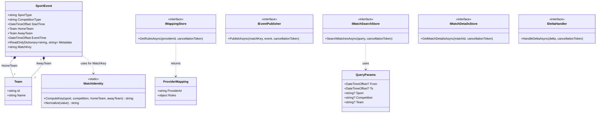

# Entity Graph & Domain Model

This document outlines the core domain entities and key architectural interfaces of the `StatefulTaskApproach` project using a Mermaid diagram. It is designed to give AI agents a precise structural understanding of the system's abstractions.

## Domain & Interface Graph

### Key Concepts for Agents
- **`SportEvent`**: The single normalized DTO used across the entire pipeline after validation. All provider-specific shapes are transformed into this by the Validation Service.
- **`MatchIdentity`**: Crucial for stateful classification. It computes an order-agnostic SHA256 key based on `SportType`, `CompetitionType`, and sorted `Team.Name`s. This is the Kafka partition key for the `validated-events` topic, ensuring all events for a match go to the same Flink node.
- **Ports & Adapters**: The interfaces (`IMappingStore`, `IEventPublisher`, etc.) define the *Ports*. Concrete implementations exist in `SportsPipeline.Infrastructure.*` projects.
