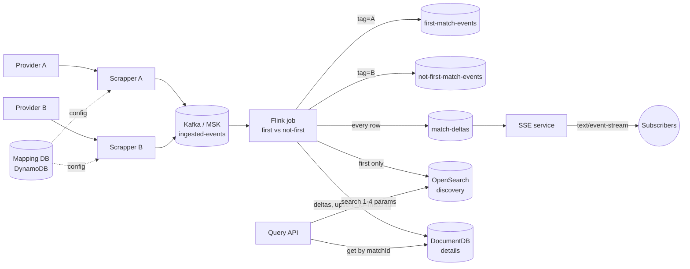
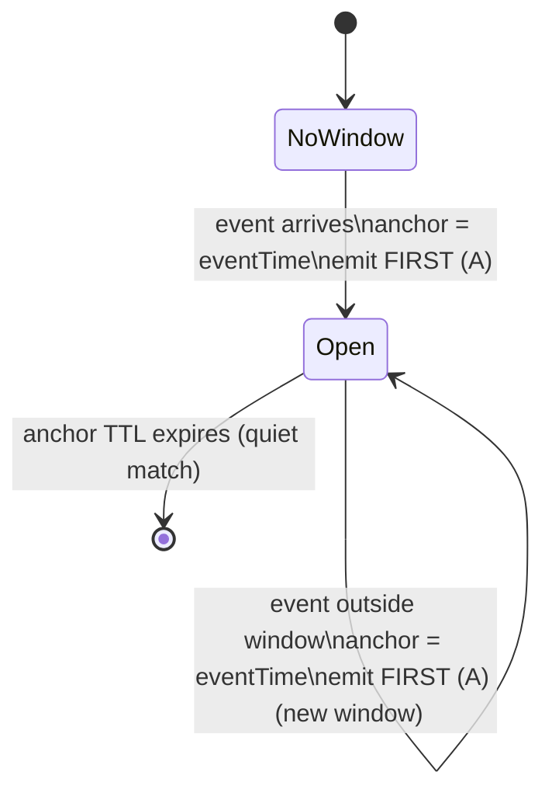
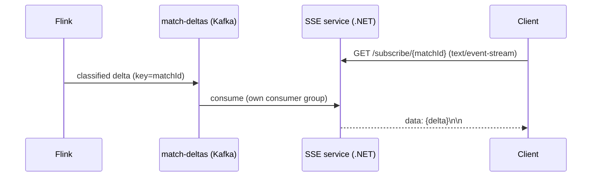

# Sports Data Pipeline — Architecture

## 1. Context & goals

Ingest events from multiple external sports-data providers, normalize each provider's format into one
internal domain model, run a **stateful first-vs-not-first classification**, push live **deltas** to
subscribed users, and serve **flexible historical + in-window queries** — all on AWS, without letting
query load degrade the ingestion pipeline.

Requirements mapped to this design:

| Requirement | Where it lives |
|---|---|
| Provider→domain mapping DB | `SportsPipeline.Mapping` + DynamoDB |
| Scrapper(s) with configs, validation, rate-limit compliance | `SportsPipeline.Scrapper` |
| Push processed data to AWS Kafka | Confluent.Kafka producer → Amazon MSK |
| Flink: first-match vs not-first (±2h, order-agnostic) | `flink/match_pipeline.sql` (+ Java reference) |
| First → its own topic; others aggregated → another topic | `first-match-events`, `not-first-match-events` |
| Live deltas to subscribers (SSE) | `match-deltas` topic → `SportsPipeline.Sse` |
| Query any combo of 1–4 params (time/competition/sport/team) | `SportsPipeline.QueryApi` over OpenSearch |
| In-window and out-of-window history | OpenSearch (discovery) + MongoDB (details) |

## 2. Component & data flow

Ingestion (left of Flink) and query (Query API) never share a datastore connection — a textbook
**CQRS** split. The write path only writes Kafka; read stores are populated asynchronously by Flink.

## 3. Domain model & match identity

Domain DTO (`SportsPipeline.Domain/SportEvent.cs`): `SportType, CompetitionType, StartTime, HomeTeam,
AwayTeam, EventTime, Metadata`. Teams are `{ Id, Name }`.

**Order-agnostic match key** (`SportsPipeline.Domain/MatchIdentity.cs`): normalize each component
(trim, lower-invariant, collapse whitespace, strip diacritics), **sort the two team names**, join
`sport|competition|teamA|teamB`, `SHA-256` → hex. So Arsenal-vs-Chelsea and Chelsea-vs-Arsenal (any
casing/accents) collapse to one key. This key is the **Kafka partition key** (all events for a fixture
are ordered on one partition) and the **classification key** in Flink.

The ±2h decision uses `EventTime` ("the event's timestamp field"); `StartTime` is the scheduled
kick-off and is carried for querying.

## 4. Scrapper

One **shared codebase**, deployed as **one instance per provider** (separate ECS service each).

> **Why per-provider, not one multi-provider service?** Independent rate-limit/backoff state,
> blast-radius isolation (one provider's 429s/outage/poison data can't starve the others), independent
> scaling and deploys. A single all-providers service is a noisy-neighbor and scales coarsely.
> Provider-specific quirks live in small adapters behind a common interface; the core (poll, backoff,
> validate, map, publish) is shared.

Pipeline per poll (`ScrapperWorker.cs`):
1. **Rate-limit compliance** — client-side token bucket (`ProviderPoller.cs`, `System.Threading.RateLimiting`) sized to the provider's published RPS/burst, so we never exceed it.
2. **Resilient fetch** — Polly retry with **exponential backoff + jitter**, honoring `Retry-After`/HTTP 429 (`PollyPolicies.cs`).
3. **Security validation** (`ResponseValidator.cs`) — TLS enforced; bounded response size; allowed content-types; per-event string-length bounds; control-character sanitization; timestamp-skew bounds; max events per response. (A formal JSON Schema, e.g. JsonSchema.Net, drops in here.) Secrets are referenced by name (Secrets Manager), never inlined.
4. **Map** provider JSON → domain via the mapping DB rules (`ProviderEventMapper.cs`).
5. **Publish** to `ingested-events` with an **idempotent** producer (`acks=all`, `enable.idempotence=true`), keyed by match key (`KafkaEventPublisher.cs`).

Mapping DB (`IMappingStore`): `DynamoDbMappingStore` (key=`providerId`, rules as a JSON blob) in AWS;
`JsonFileMappingStore` for local. Rules map source field paths → domain fields and translate values
(e.g. `SOCCER`→`Football`, `EPL`→`English Premier League`).

## 5. Stateful classification (Flink)

### State machine (per match key)

- **First match** = no prior event for the key, OR the event is outside ±2h of the existing anchor
  (→ opens a new window; same teams next week is a new first match).
- **Not-first** = within ±2h of the anchor (aggregated into the current window).
- `matchId = matchKey + "_" + windowStart` — shared by the window's first event and all its deltas, so
  OpenSearch (first) and MongoDB (deltas) align on the same id.

### Two implementations (see `flink/README.md`)

Flink SQL `MATCH_RECOGNIZE` is **`ONE ROW PER MATCH` only** and SQL cannot reset a per-key anchor, so
exact anchored ±2h **per-event** classification is not expressible in pure SQL.

- **Shipped — `flink/match_pipeline.sql`**: relaxed rule (`LAG`: gap-from-previous > 2h = first),
  per-event and instant, all I/O declarative (Kafka source; Kafka/OpenSearch/DocumentDB sinks).
  Its `matchId = matchKey + "_" + DATE_FORMAT(startTime,'yyyyMMdd')` — bucketed on **startTime**
  (constant per game) so a fixture spanning midnight stays one id; the Java version uses the exact
  anchor instead.
- **Exact — `flink/java/.../FirstMatchClassifier.java`**: `KeyedProcessFunction` with a per-key anchor
  `ValueState` + state TTL implementing the precise spec and anchor-based `matchId`.

Outputs: `first-match-events` (A), `not-first-match-events` (B), `match-deltas` (every row, keyed by
matchId), OpenSearch (A only), MongoDB (every row, upsert by `_id`).

## 6. Live deltas over SSE

Flink cannot push SSE to clients. The bridge:

`SportsPipeline.Sse` consumes `match-deltas` and fans each record out to the locally-connected
subscribers of that `matchId` (`DeltaBroker.cs`). Each instance uses its **own consumer group**, so
every instance sees every delta and can serve any subscriber — **no Redis needed for fan-out**. Redis
stays optional as a live-snapshot/TTL cache.

## 7. Query path (CQRS, two stores)

- **OpenSearch = discovery.** First-match rows only → one lightweight doc per match. `GET /matches`
  builds a `bool` filter from any 1–4 of {time range, sport, competition, team}; the team filter hits
  the order-agnostic `teams` array (`MatchQueryBuilder.cs`). Returns `matchId`s.
- **Amazon DocumentDB (Mongo-compatible) = details.** `GET /matches/{matchId}` is a point lookup by
  `_id` — read-your-write fresh. DocumentDB scales reads via replicas; writes hit a single primary
  (no sharding), so size the primary and use per-event/bucketed docs. Connection needs `tls=true` +
  the RDS CA bundle + `retryWrites=false`.

This split means search load (OpenSearch) and detail load (Mongo) are isolated from each other **and**
from ingestion. Why two stores: OpenSearch's inverted index is ideal for ad-hoc multi-field discovery;
Mongo gives immediate freshness + cheap point lookups for the full document. (Redis is not a
substitute for either — it's an in-memory hot/pub-sub tier, not a durable ad-hoc query store.)

**Freshness note:** Mongo is read-your-write immediate; OpenSearch is near-real-time (~1s default
`refresh_interval`, and you raise it under heavy indexing). That's why details (latency-sensitive
lookups) live in Mongo and discovery (tolerates ~1s) lives in OpenSearch.

## 8. Retention / "post-window" data

There is **no explicit window-end record**. The only window state is the Flink keyed anchor (RocksDB +
changelog) with a **state TTL**; when an event lands >2h past the anchor a new window simply opens and
the stale anchor expires. The **events themselves** (in-window and beyond) are durable in OpenSearch
(first) and MongoDB (all), which is what answers "last week / next week" queries. Use OpenSearch
time-based indices + ISM and a Mongo TTL/archival policy for long-term retention tiers.

## 9. Failure modes

- **Provider outage / 429** → Polly backoff + circuit breaker; isolated to that provider's instance.
- **Poison record** → dropped with a warning in the scrapper; never blocks the poll loop.
- **Kafka redelivery** → idempotent producer on write; sinks upsert by `matchId` (idempotent).
- **Out-of-order / late events** → event-time + watermark in Flink; very-late events are dropped (a
  side-output dead-letter is the production add-on).
- **SSE slow client** → bounded per-subscriber channel drops oldest, never blocks the consumer.

## 10. AWS mapping (see `deploy/iac`)

MSK (Kafka) · Amazon Managed Service for Apache Flink (runs the SQL or Java job) · OpenSearch Service
(discovery) · Amazon DocumentDB (details) · DynamoDB (mapping) · ECS Fargate (scrapper-per-provider,
sse, query-api) · Secrets Manager · optional ElastiCache Redis · ALB.

## 11. Future work

- Exact-semantics Flink Java job to production (it already exists as the reference).
- Avro + Schema Registry on the topics; dead-letter topic for late/invalid records.
- Redis-backed multi-instance SSE snapshot/TTL; AuthN/Z on the Query/SSE APIs.
- Full, deployable CDK (the current stack is a skeleton).
