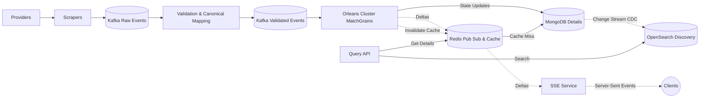
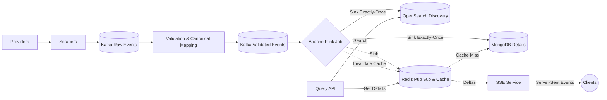
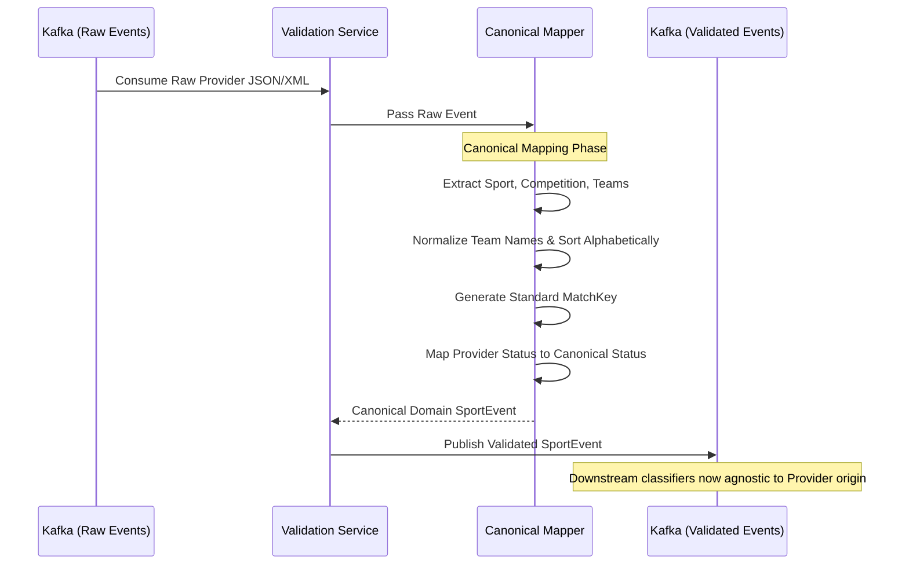
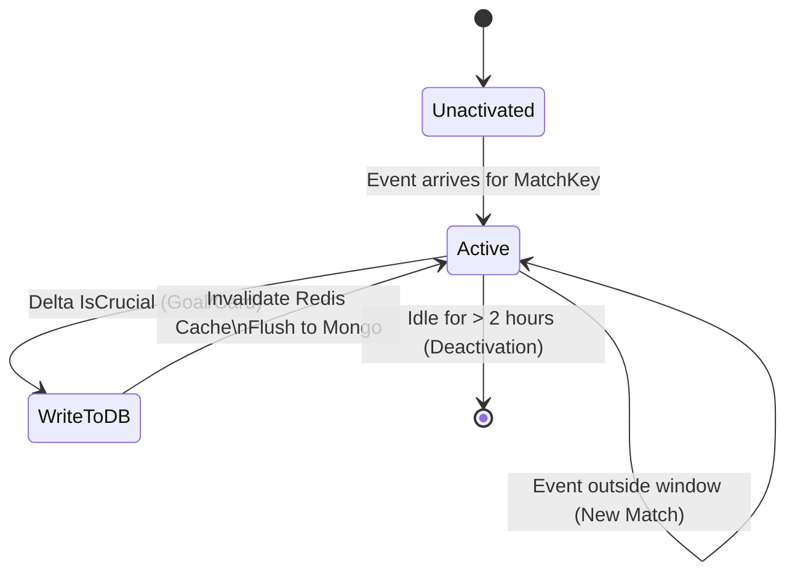
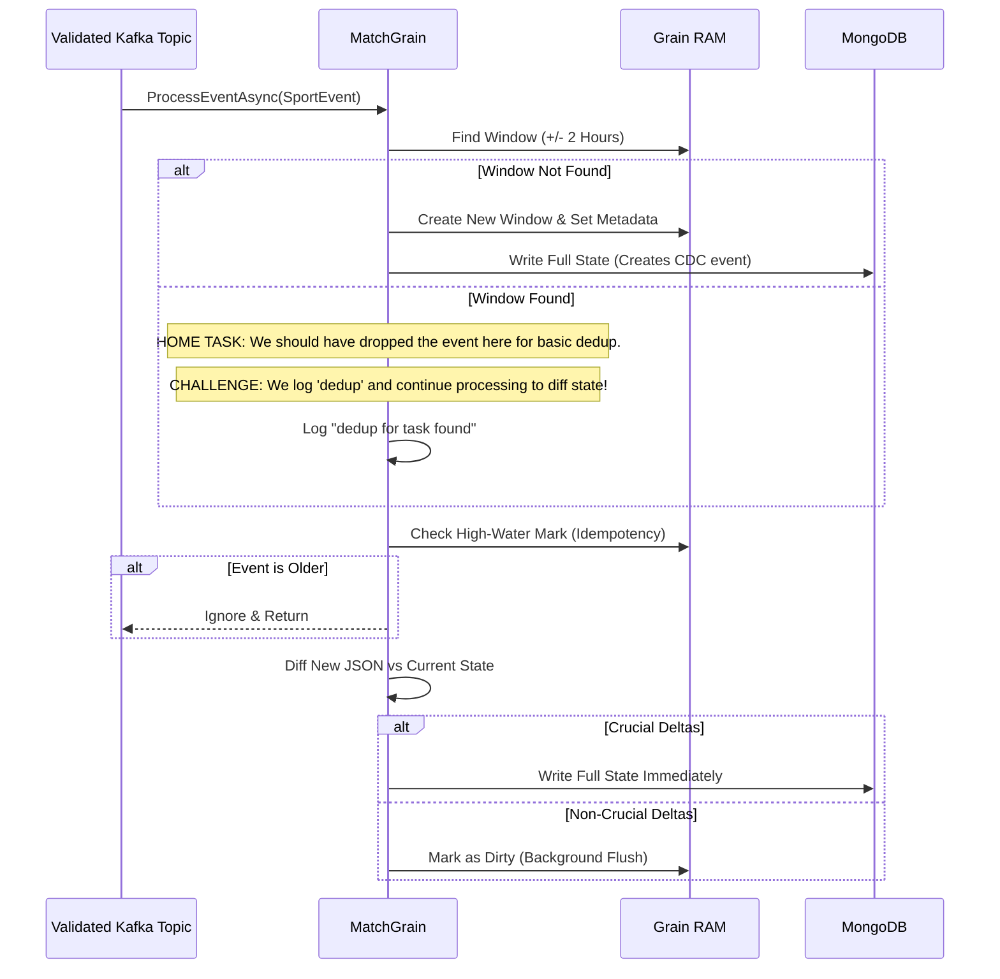
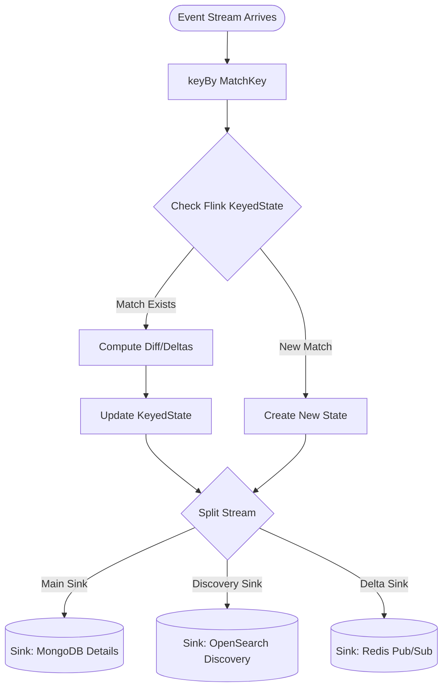
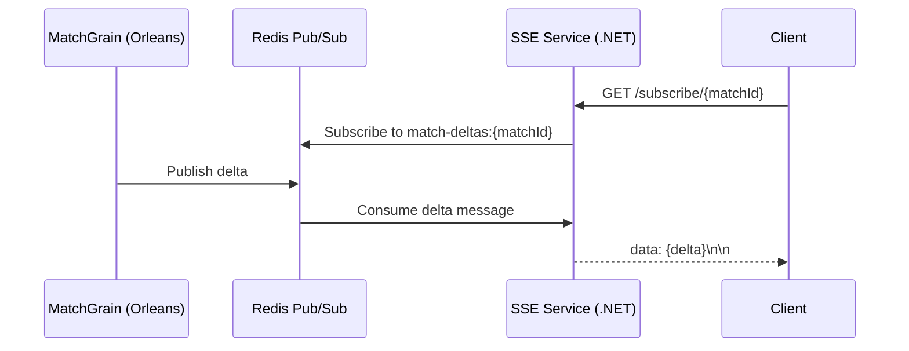
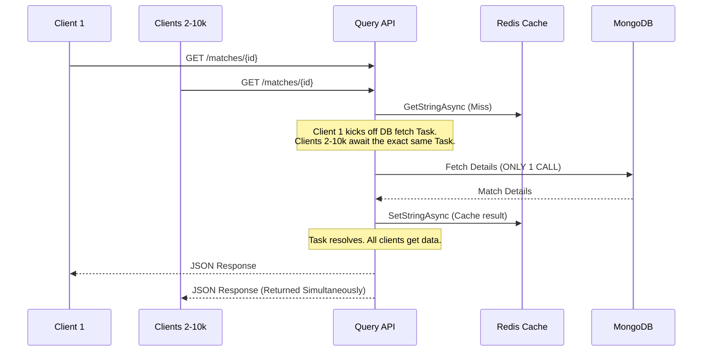

# Sports Data Pipeline — Architecture

## 1. Context & Goals

Ingest events from multiple external sports-data providers, normalize each provider's format into one internal domain model, run a **stateful classification**, push live **deltas** to subscribed users, and serve **flexible historical + in-window queries** — all on AWS, without letting query load degrade the ingestion pipeline.

Requirements mapped to this design:

| Requirement | Implementation |
|---|---|
| Provider→domain mapping DB | `SportsPipeline.Validator` + MongoDB |
| Scrapers with validation, rate-limit compliance | `SportsPipeline.Scraper` |
| Push processed data to Message Broker | Confluent.Kafka producer |
| Stateful Classification & Aggregation | `SportsPipeline.Classifier.Orleans` (Microsoft Orleans) |
| Persistent Datastores | OpenSearch (Discovery), MongoDB (Details) |
| Live deltas to subscribers (SSE) | Orleans → Redis Pub/Sub → `SportsPipeline.Sse` |
| High-Concurrency Query Caching | `SportsPipeline.QueryApi` + Redis (Semaphore Stampede Protection) |

## 2. Component & Data Flow

You can choose between two processing engines (Microsoft Orleans or Apache Flink) based on your team's expertise. (See [Orleans vs Flink Trade-offs](orleans_vs_flink_v2.md) for details on why both are supported and their specific trade-offs).

### Option A: Microsoft Orleans (Actor Model)

### Option B: Apache Flink (Stream Processing)

Ingestion (left of Orleans/Flink) and query (Query API) never share a datastore connection — a textbook **CQRS** split. The read stores are populated asynchronously by the classification engines.

## 3. Domain Model & Match Identity

Domain DTO (`SportsPipeline.Domain/SportEvent.cs`): `SportType, CompetitionType, StartTime, HomeTeam, AwayTeam, EventTime, Metadata`. Teams are `{ Id, Name }`.

**Order-agnostic match key** (`SportsPipeline.Domain/MatchIdentity.cs`): normalizes each component (trim, lower-invariant, strip diacritics), **sorts the two team names**, joins `sport|competition|teamA|teamB`, and hashes via `SHA-256`. 
*Arsenal-vs-Chelsea* and *Chelsea-vs-Arsenal* collapse to one key. This key is the **Kafka partition key** and the **Orleans Grain Primary Key**.

## 4. Scraper & Validation

One **shared codebase**, deployed as **one instance per provider**.
*Why per-provider?* Independent rate-limit/backoff state, blast-radius isolation, independent scaling.

Pipeline per poll:
1. **Rate-limit compliance** — client-side token bucket (`System.Threading.RateLimiting`).
2. **Resilient fetch** — Polly retry with **exponential backoff + jitter**.
3. **Validation & Canonical Mapping** — JSON → domain via MongoDB rules (`ProviderEventMapper.cs`). This translates raw provider events to a single "canonical" Domain Model, aligning "our side" of the system with the infinite variations of provider formats.
4. **Deduplication** — Edge hashing limits pushing identical payloads.
5. **Publish** — Idempotent producer to Kafka.

### Canonical Mapping Sequence (Raw to Validated)
To ensure the pipeline is agnostic to infinite provider variations, all raw events pass through a mapping phase before entering the main classification engine.

## 5. Stateful Classification

Depending on the engine chosen, the internal flow differs significantly.

### Option A: Microsoft Orleans (Detailed Grain Flow)

Orleans uses Virtual Actors (Grains). The grain lives in RAM and uses MongoDB as its source of truth, with CDC syncing OpenSearch.

1. **Virtual Actors:** We don't manually create Grains. When Kafka pushes an event for `match-123`, Orleans automatically routes the message to the single `MatchGrain` responsible for `match-123`, activating it if it isn't already running.
2. **In-Memory Speed:** The `MatchGrain` holds the current `SportState` in RAM. Evaluating rules and computing diffs/deltas requires **zero network hops** to an external database.
3. **Smart Write-Behind (MongoDB Hot-Path Avoidance):**
   - When a delta is calculated, it's immediately published to Redis.
   - If the delta is highly frequent but low value (e.g., a pass), the Grain stays in RAM. A background timer flushes it to MongoDB every 10 seconds.
   - If the delta `IsCrucial` (e.g., Goal, Red Card), the Grain **immediately** writes to MongoDB to guarantee persistence.

#### Detailed MatchGrain Processing Sequence
This outlines the exact flow of `ProcessEventAsync` from Kafka into MongoDB. 

> **Important Task Context:** As part of the basic home task requirements, if an event was found within the `+/- 2 hours` window (meaning it's a duplicate or related update), we should have **STOPPED** processing and just dropped it to satisfy the basic "dedup" requirement. However, in this implementation, we simply log "dedup for task found" and **CONTINUE** processing the event through the diffing engine as an advanced challenge.

### Option B: Apache Flink (Detailed Job Flow)

Flink uses keyed streams and keyed state (`ValueState<Match>`). It guarantees exact-once semantics using Two-Phase Commit to multiple sinks, eliminating the need for CDC for OpenSearch.

## 6. Live Deltas over SSE (Fan-Out Architecture)

We use a **Redis Backplane** to bridge the Orleans processing layer and the stateless Web API layer.
* `SportsPipeline.Classifier.Orleans` pushes lightweight JSON deltas to a Redis Pub/Sub channel.
* `SportsPipeline.Sse` web nodes subscribe to Redis and fan out the messages to connected HTTP clients using Server-Sent Events (SSE).
* This ensures the web nodes remain stateless and perfectly horizontally scalable.

> **Note:** For a comprehensive breakdown of alternative fan-out architectures (including Kafka+SSE and Native Orleans Streams) and why Redis Pub/Sub was chosen, see the [Fan-Out Architecture & Caching Strategy](architecture-fanout.md) document.

## 7. Query Path & Caching (Thundering Herd Protection)

The `SportsPipeline.QueryApi` handles two primary operations using isolated databases:

- **OpenSearch (Discovery):** Ad-hoc searching using 1-4 parameters (sport, competition, team, time). Returns a list of `MatchSummary` objects.
- **MongoDB (Details):** Point lookup by `matchId`.

### Caching Strategy & Cache Invalidation
To protect MongoDB from catastrophic traffic spikes, we aggressively cache the full match details in Redis.
* **Non-Live Matches:** Safely cached indefinitely (24h TTL) since the game has concluded.
* **Live Matches:** When Orleans processes a crucial update (like a goal), it immediately calls `ICacheInvalidator`, actively deleting the Redis key. The very next user query will fetch the fresh score from MongoDB and re-seed the cache.

### Stampede Prevention (Request Coalescing)
If the cache is empty (or just invalidated) and 10,000 users simultaneously request the match details, a naive implementation would blast MongoDB with 10,000 identical queries.

We implemented `CacheStampedeProtector` using an in-memory `ConcurrentDictionary<string, Task<string>>` (Request Coalescing/Task Multiplexing). Exactly **1** request is allowed to query MongoDB. The other 9,999 requests await the exact same Task and resolve simultaneously without clogging threads.

## 8. Failure Modes

- **Provider outage / 429** → Polly backoff + circuit breaker; isolated to that provider's instance.
- **Poison record** → dropped with a warning in the scraper; never blocks the poll loop.
- **Orleans Node Crash** → Orleans automatically resurrects the `MatchGrain` on another healthy node. It rehydrates its state from MongoDB and resumes processing seamlessly.
- **SSE slow client** → bounded per-subscriber channel drops oldest, never blocks the consumer.
- **Traffic Spike** → Thundering Herd protection guarantees 10,000 API requests result in 1 DB query.

## 9. AWS Mapping (Deployment)

Kafka (Amazon MSK) · OpenSearch Service (Discovery) · MongoDB Atlas on AWS (Details) · ECS Fargate (Scrapers, Query API, SSE) · ElastiCache Redis (Pub/Sub & Cache) · Secrets Manager · ALB.
