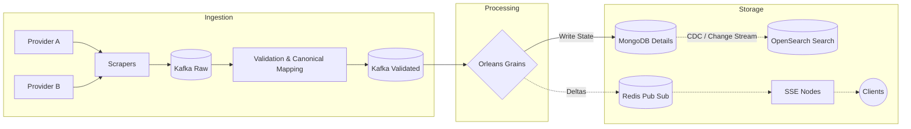
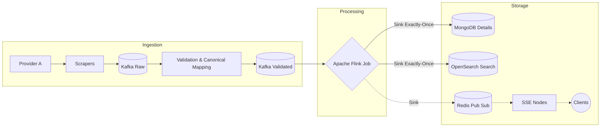
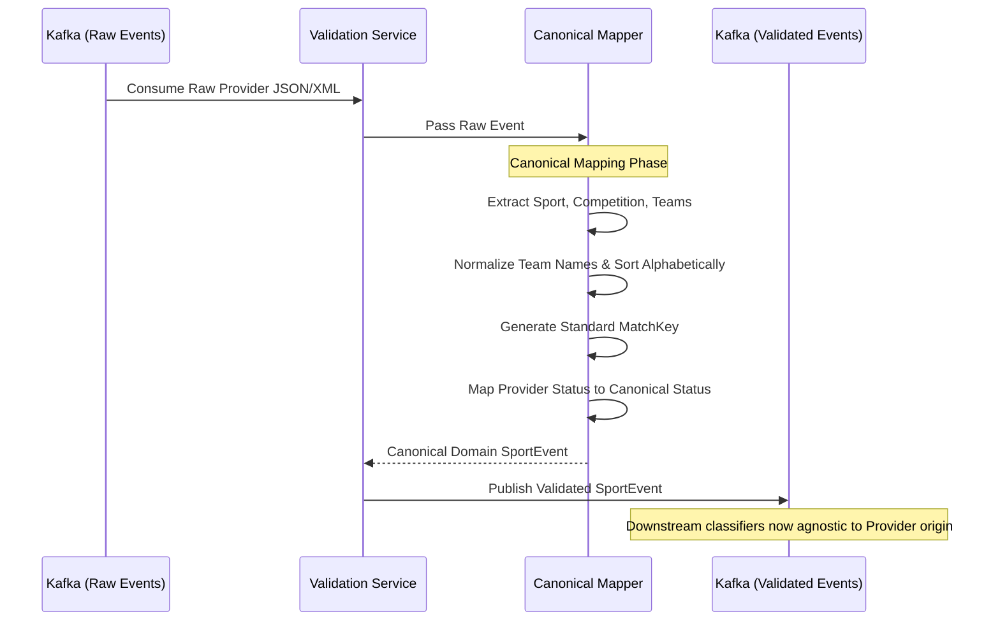
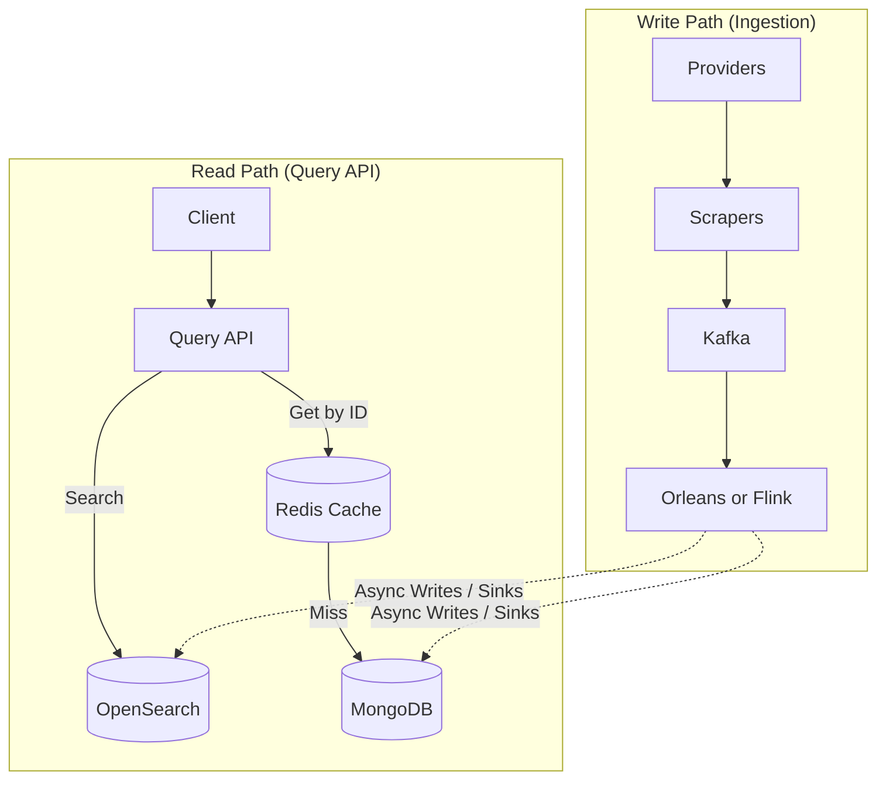
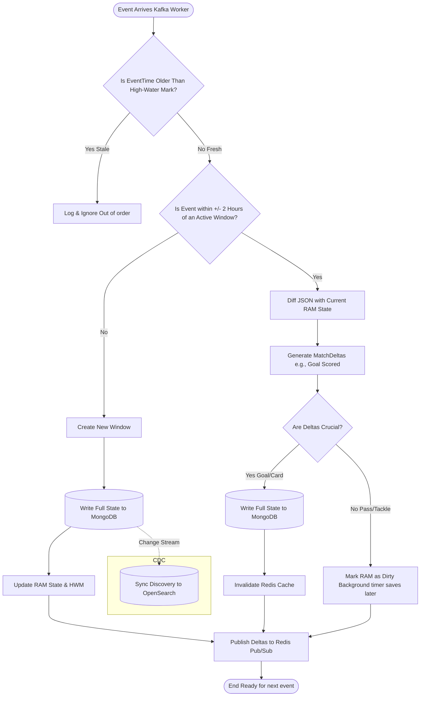
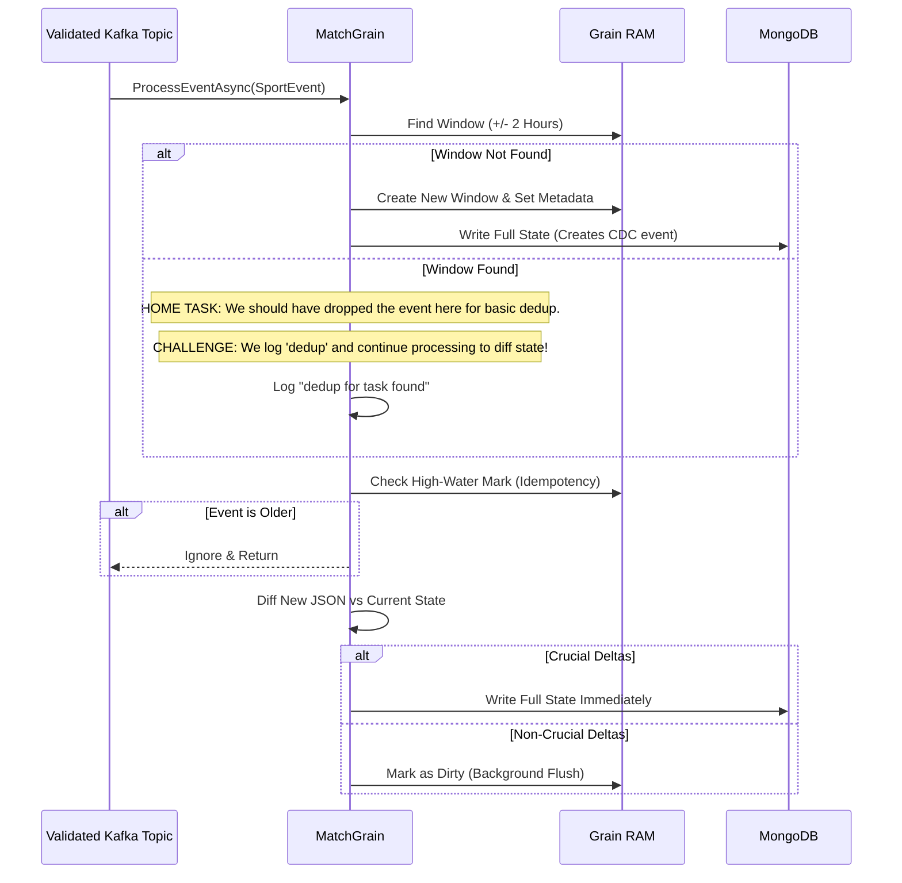
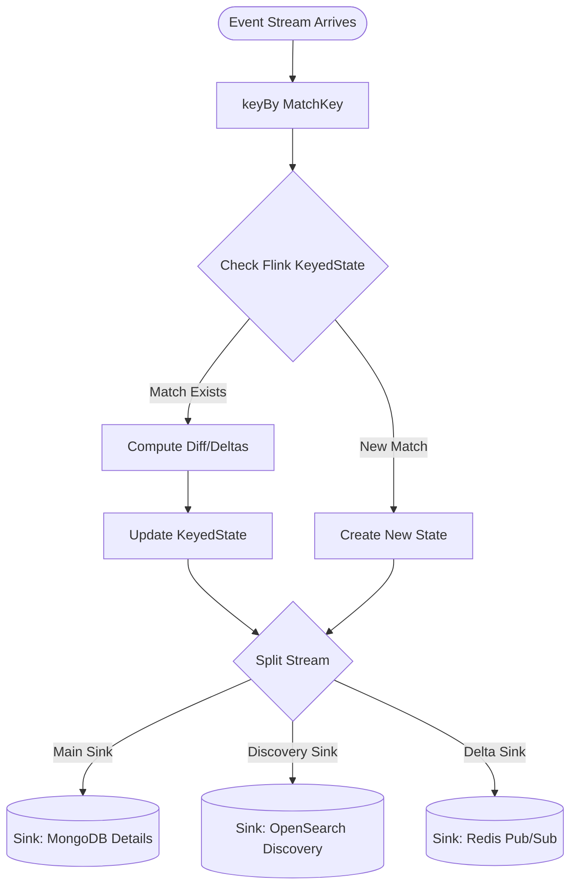
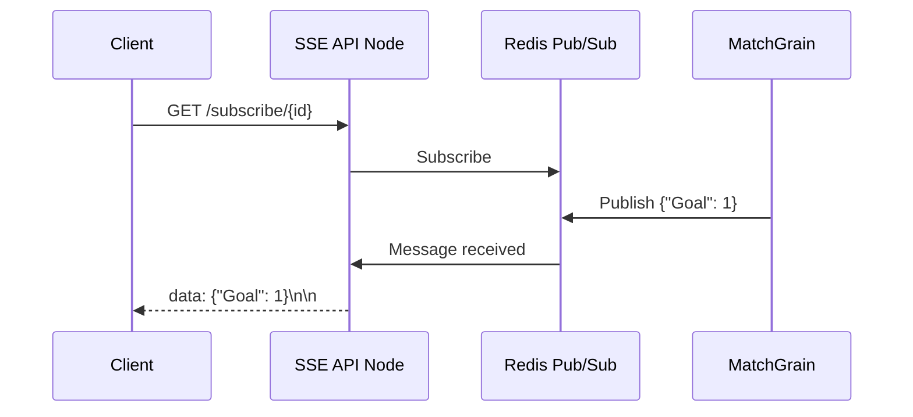
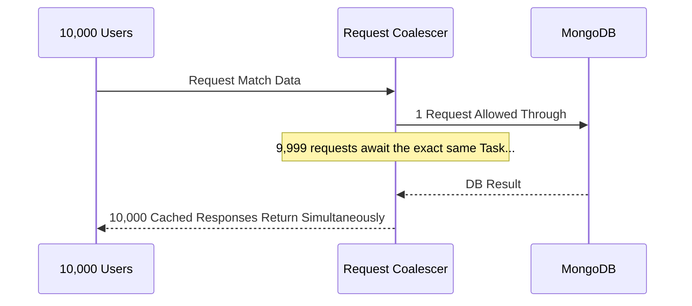

# Architecture TL;DR (Visual Overview)

This document provides a high-level, visual summary of the Sports Data Pipeline. For detailed explanations, see the [Main Architecture Document](architecture.md).

## System Highlights (Why this architecture works)

* **Supports High Throughput:** **Kafka** acts as a massive, partitioned buffer. Fast producers (Scrapers) dump data into Kafka immediately, allowing the system to absorb massive spikes in data volume without slowing down.
* **Always Available (Never Stalls):** The system relies on **Asynchronous Processing**. **Crucial updates** (like Goals) are written synchronously to the database immediately. **Non-crucial updates** (like live coordinates) are updated in RAM, and the database write is deferred (write-behind caching based on configuration, e.g., every 10 seconds). This keeps the pipeline extremely fast while guaranteeing crash safety for important data. See the [Main Architecture Document](architecture.md#stateful-classification) for details.
* **Distributed & Horizontally Scalable:** Scrapers are deployed as independent, isolated worker containers that poll external sources and write to Kafka. You can scale workers infinitely without them stepping on each other's toes.
* **Optimized for Massive Reads:** Using **CQRS**, read traffic is physically isolated from write traffic. The system uses a **Redis Cache with Request Coalescing (Task Multiplexing)** to serve millions of simultaneous read requests, ensuring that 10,000 clients trigger exactly 1 database query without clogging threads.
* **Flexible Ad-Hoc Filtering:** **OpenSearch** maintains an inverted index of all matches, allowing clients to instantly filter by any combination of time range, sport, competition, and team names.

---

## 1. High-Level Data Flow

A real-time, stateful processing pipeline that ingests raw provider XML/JSON, diffs the state, and fans out live deltas to millions of users. 

**Canonical Mapping:** A critical step in ingestion is the "Validation & Canonical Mapping" phase. This translates raw, infinite variations of provider-specific data formats into a single, canonical "Domain Model." This aligns "our side" of the system, allowing downstream classifiers to operate entirely agnostically of the original provider.

You can choose between two processing engines (Microsoft Orleans or Apache Flink) based on your team's expertise. (See [Orleans vs Flink Trade-offs](orleans_vs_flink_v2.md) for details on why both are supported and their specific trade-offs).

### Option A: Microsoft Orleans (Actor Model)

### Option B: Apache Flink (Stream Processing)

### Canonical Mapping Sequence (Raw to Validated)
To ensure the pipeline is agnostic to infinite provider variations, all raw events pass through a mapping phase before entering the main classification engine.

## 2. CQRS (Command Query Responsibility Segregation)

Reads and writes are strictly separated to prevent query traffic from degrading the ingestion engine.

## 3. Stateful Classification

Depending on the engine chosen, the internal flow differs significantly.

### Option A: Microsoft Orleans (Detailed Grain Flow)

Orleans uses Virtual Actors (Grains). The grain lives in RAM and uses MongoDB as its source of truth, with CDC syncing OpenSearch.

#### Detailed MatchGrain Processing Sequence
This outlines the exact flow of `ProcessEventAsync` from Kafka into MongoDB. 

> **Important Task Context:** As part of the basic home task requirements, if an event was found within the `+/- 2 hours` window (meaning it's a duplicate or related update), we should have **STOPPED** processing and just dropped it to satisfy the basic "dedup" requirement. However, in this implementation, we simply log "dedup for task found" and **CONTINUE** processing the event through the diffing engine as an advanced challenge.

### Option B: Apache Flink (Detailed Job Flow)

Flink uses keyed streams and keyed state (`ValueState<Match>`). It guarantees exact-once semantics using Two-Phase Commit to multiple sinks, eliminating the need for CDC for OpenSearch.

### How Live Matches Are Supported:
1. **Deltas:** Even if an event is merged into an existing window and doesn't trigger a database write, the exact differences (Deltas) are instantly pushed to Redis Pub/Sub.
2. **SSE Fan-Out:** The stateless Web API nodes consume those Deltas and push them to millions of connected WebSocket/SSE clients in milliseconds.
3. **Cache Invalidation:** If a crucial event happens (like a Goal), the database is updated and the cache is cleared. The next user to open the app will instantly see the new score.

## 4. Live Fan-Out (SSE over Redis)

Web nodes are kept completely stateless. Orleans pushes data into a Redis Backplane, which fans out to all connected Web APIs.

## 5. Thundering Herd Protection (Stampede Prevention)

If 10,000 users open a live match at the exact same millisecond, an in-memory **Request Coalescer (Task Multiplexing)** ensures MongoDB only gets hit **once**.

## 6. Codebase Mapping (Home Task Requirements)

This section maps the specific requirements of the home task to their exact locations in the codebase.

| Requirement | Code Location | Description |
|---|---|---|
| **1. Ingestion and Processing logic** (Mocked data, Deduplication) | `SportsPipeline.Scraper/` (Ingestion) `SportsPipeline.Classifier.Orleans/` (Processing) | Scraper module fetches and mocks provider data. The `MatchGrain` handles core processing and explicitly implements **deduplication** by checking the `ActiveMatchWindow` and rejecting duplicates/stale events via `ProviderHighWaterMarks`. |
| **2. API implementation** (Production-like) | `src/SportsPipeline.QueryApi/` | Production-grade ASP.NET Core API enforcing CQRS. Implements advanced, production-ready patterns like Task Multiplexing (`CacheStampedeProtector.cs`) to safely serve massive read traffic. |
| **3. Modules decomposition, interfaces and data flow** | `src/SportsPipeline.Domain/` `src/SportsPipeline.Abstractions/` `src/SportsPipeline.Infrastructure.*/` | Strict Clean Architecture. **Domain** contains canonical models. **Abstractions** define decoupled interfaces. **Data Flow** dependencies (Kafka, Redis, Mongo) are isolated into independent infrastructure modules and injected via DI. |

---
**Further Reading:**
* [Full Architecture & Setup](architecture.md)
* [Orleans vs Flink Trade-offs](orleans_vs_flink_v2.md)
* [Fan-out & Caching Strategies](architecture-fanout.md)
